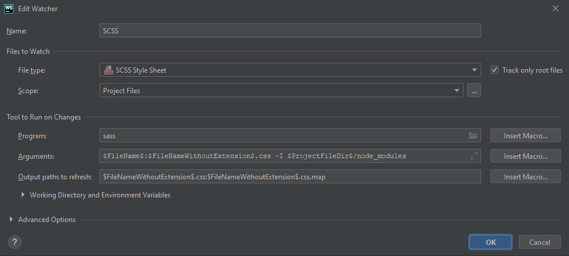

# Fract
First try to create a web toolbox using fractal

After configuring fractal by fractal.js

Start fractal with:
```bash
$ fractal start --sync
```
## Using handlebars
Use handlebars for extra rendering helpers. 

First install handlebars by:
```bash
$ npm install --save @frctl/handlebars
```

## IDE
Using webstorm

Configuration for scss 

## References
- fractal
    - website https://fractal.build/
    - fractal cli https://fractal.build/guide/cli/
    - project setup https://fractal.build/guide/project-settings.html
- handlebars
    - website https://handlebarsjs.com/
